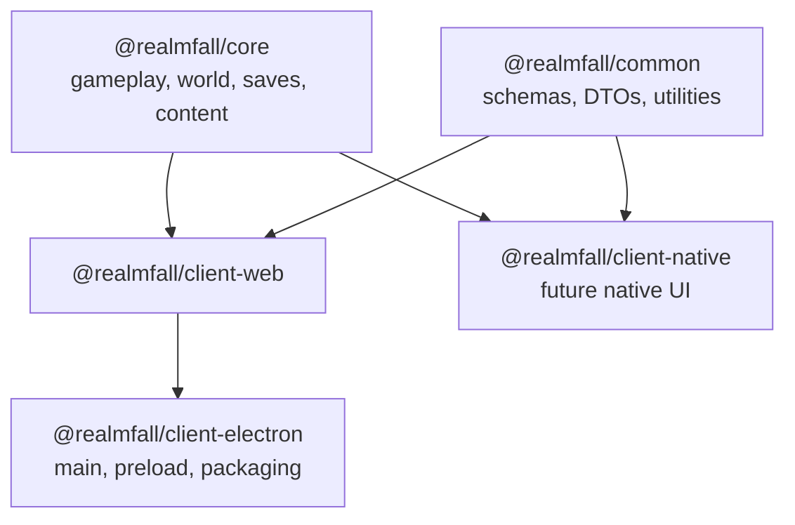

# Cross-Platform Clients Design

Date: 2026-05-12
Status: Draft for review

## Summary

Realmfall should expand to additional clients by reusing shared gameplay and data logic rather than introducing runtime-composed frontend architecture such as Module Federation.

The immediate target is an Electron desktop client that runs the existing web client essentially as-is inside a thin desktop shell. A future React Native client should start as a narrower client that reuses shared logic from the monorepo, while keeping its own UI and platform-specific runtime.

## Current Context

- The repository already separates shared gameplay and platform-specific concerns across `@realmfall/core`, `@realmfall/common`, `@realmfall/ui-react`, and `@realmfall/client-web`.
- `@realmfall/core` is the canonical home for gameplay, world state, progression, content, and save-related logic.
- `@realmfall/client-web` is the current browser game client with React and Pixi.
- `@realmfall/ui-react` is a shared React DOM component library for web surfaces, not a cross-platform UI layer.

This structure is already closer to the desired cross-platform shape than a microfrontend architecture would be.

## Goals

- Ship an Electron desktop client with minimal divergence from the existing web client.
- Preserve the existing web client as a standalone browser target.
- Keep shared gameplay, content, and save logic reusable across future clients.
- Leave room for future desktop local save files that can be synced through Steam Cloud.
- Allow a future React Native client to start small while reusing shared logic.

## Non-Goals

- Do not introduce Module Federation or other remote runtime composition for the main game clients.
- Do not attempt cross-platform UI reuse between React DOM and React Native at this stage.
- Do not implement desktop local save files or Steam Cloud sync in the first Electron iteration.
- Do not scaffold the React Native client until work on that client begins.

## Decision

Use a shared-domain monorepo architecture:

- Shared logic remains in `@realmfall/core` and `@realmfall/common`.
- The web game remains in `@realmfall/client-web`.
- Electron is added as a thin shell package around `@realmfall/client-web`.
- React Native is deferred, and when it starts it reuses shared logic only.

## Why Not Module Federation

Module Federation solves independent frontend deployment and runtime module loading. That does not match the near-term needs for Realmfall:

- Electron should host the current web app, not compose independent remote applications.
- React Native will need a separate UI and rendering stack anyway.
- A game client benefits from fewer runtime loading boundaries on its main path.
- The repository already has package-level reuse, which solves the actual cross-platform need more directly.

Module Federation may become relevant later for separate operational or account-facing web surfaces if those ever need independent deployment, but it should not be the baseline client architecture for the game itself.

## Package Strategy

### Keep

- `packages/core`
  - Canonical gameplay simulation
  - World and progression logic
  - Save shape, normalization, and related domain logic
  - Content registries and balance-driven gameplay behavior

- `packages/common`
  - Shared schemas
  - Shared DTOs and utilities
  - Cross-runtime helper logic that is not gameplay-specific

- `packages/client-web`
  - Main browser client
  - React and Pixi renderer
  - Browser-specific app shell and presentation behavior

- `packages/ui-react`
  - Shared React DOM component library for web surfaces
  - Not a cross-platform UI package

### Add Later

- `packages/client-electron`
  - Electron main process
  - Preload bridge
  - Packaging and desktop launch configuration
  - Thin host for the existing web renderer

- `packages/client-native`
  - Future React Native client
  - Separate UI and navigation layer
  - Shared logic consumption from `core` and `common`

## Platform Boundaries

### Shared Across Clients

- Gameplay rules
- World generation and content resolution
- Combat and progression systems
- Save data shape and normalization logic
- Shared schemas and validation

### Web and Electron Only

- React DOM UI
- Pixi renderer
- Browser window and dock interaction model
- Browser-oriented persistence implementation

### Electron Only

- Native shell lifecycle
- File-system-backed persistence adapter
- Native menus, tray, or platform integration when needed
- Future Steam-oriented desktop integrations

### React Native Only

- Native navigation and interaction patterns
- Touch-first UX adjustments
- Native storage adapter
- Native rendering and presentation layer

## Electron Design

### Phase 1

Electron should be a thin shell that runs the current web client with minimal renderer changes.

Principles:

- `client-web` remains the renderer application.
- The Electron shell owns the main process and preload boundary.
- The renderer should not import Electron APIs directly.
- Any future desktop-only capability should be exposed through a narrow bridge instead of branching the shared game code.

Expected outcome:

- One browser client
- One desktop shell
- Near-zero gameplay divergence between web and Electron

### Phase 2

Desktop local save files should be added as a platform persistence adapter, not as a rewrite of gameplay or save-domain logic.

Planned future note:

- The desktop client is expected to move toward local save files stored on disk.
- Those save files are expected to be compatible with Steam Cloud synchronization in a future release.
- This is a product direction and documentation note, not a requirement for the first Electron implementation.

## Persistence Direction

Before desktop save work begins, introduce or preserve a narrow persistence boundary for save operations.

Target responsibilities:

- `loadSave`
- `writeSave`
- `listSaves`
- optional metadata helpers such as last-modified or slot summaries

This boundary should allow:

- browser-backed persistence for web
- file-backed persistence for Electron
- future native persistence for React Native

The interface should stay above serialization details and below game-domain rules, so the same canonical save format can move between platforms.

## React Native Design

The first React Native client should be treated as narrower in scope than the web app, even though long-term product intent is to approach the same overall game experience.

Principles:

- Reuse `core` and `common` first.
- Do not reuse `ui-react`.
- Do not attempt to carry over the current DOM or Pixi shell.
- Only extract additional shared app-layer helpers when real duplication appears during native development.

This avoids speculative abstraction and keeps the shared layer honest.

## Architecture Diagram

## Milestones

1. Document and approve the client expansion architecture.
2. Add `packages/client-electron` as a thin shell package.
3. Keep the Electron renderer pointed at `client-web`.
4. When desktop save work starts, introduce the persistence adapter boundary if it does not already exist in the right shape.
5. Add `packages/client-native` only when native work begins.

## Risks And Guardrails

- Risk: letting desktop concerns leak into `core` or `client-web`.
  - Guardrail: keep Electron-only features behind a preload or adapter boundary.

- Risk: over-abstracting for mobile before the native client exists.
  - Guardrail: share logic first, then extract app-layer reuse only after real duplication appears.

- Risk: creating a second renderer implementation for desktop too early.
  - Guardrail: Electron should host `client-web`, not fork it.

- Risk: designing Steam Cloud sync into the initial desktop runtime.
  - Guardrail: document it as future work and keep the first desktop milestone focused on shell integration.

## Open Questions

- Which packaging and distribution path should the eventual Electron app use.
- Whether browser and desktop save slot UX should stay identical or diverge when filesystem saves arrive.
- Whether a future mobile client should target full parity or staged subsystem rollout after the initial narrower client.

## Recommendation

Proceed with a thin Electron shell over `client-web`, preserve `core` and `common` as the shared logic foundation, and defer any broader cross-platform abstraction until a real second client needs it.
